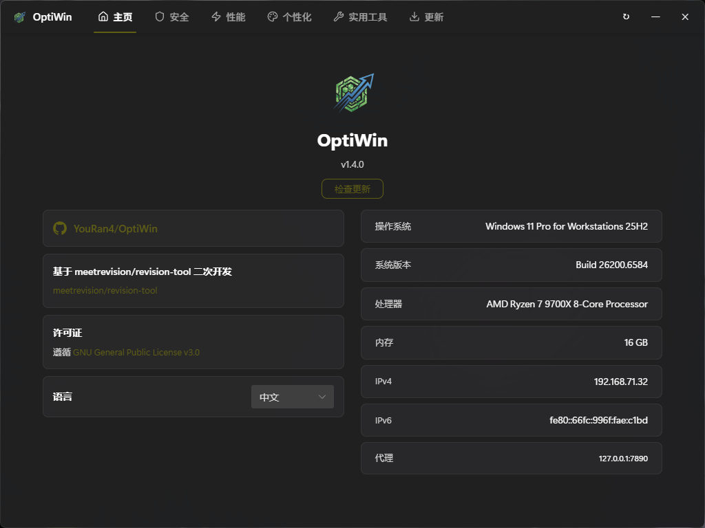
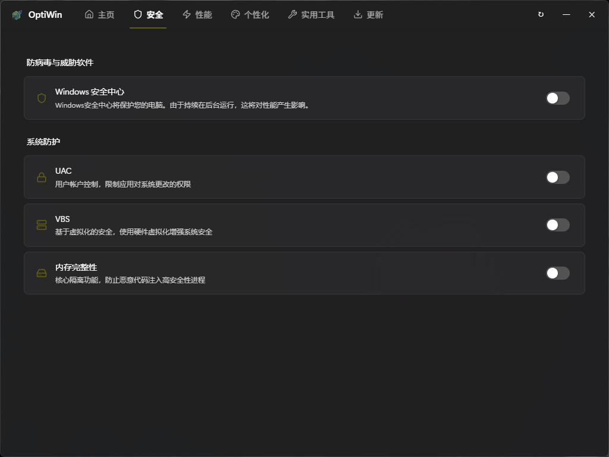
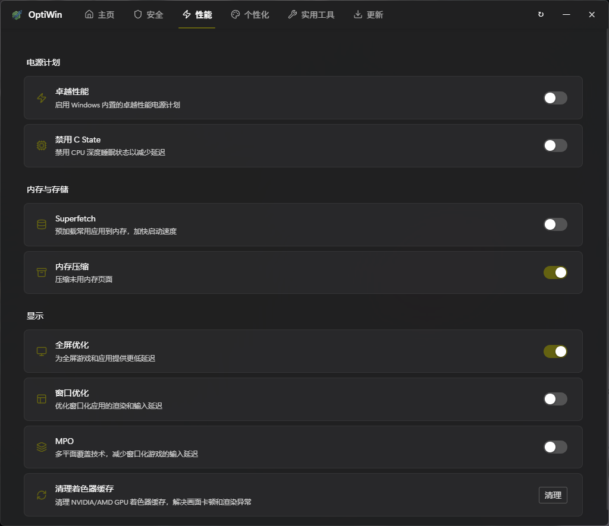
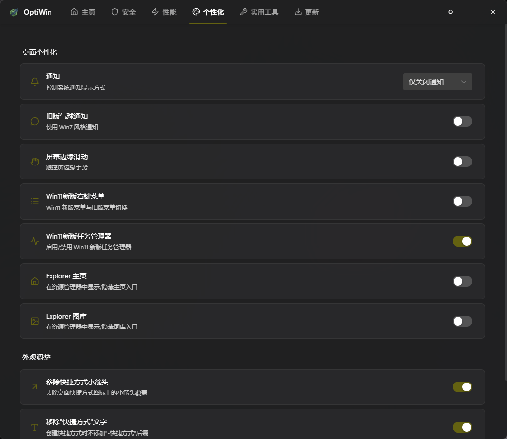
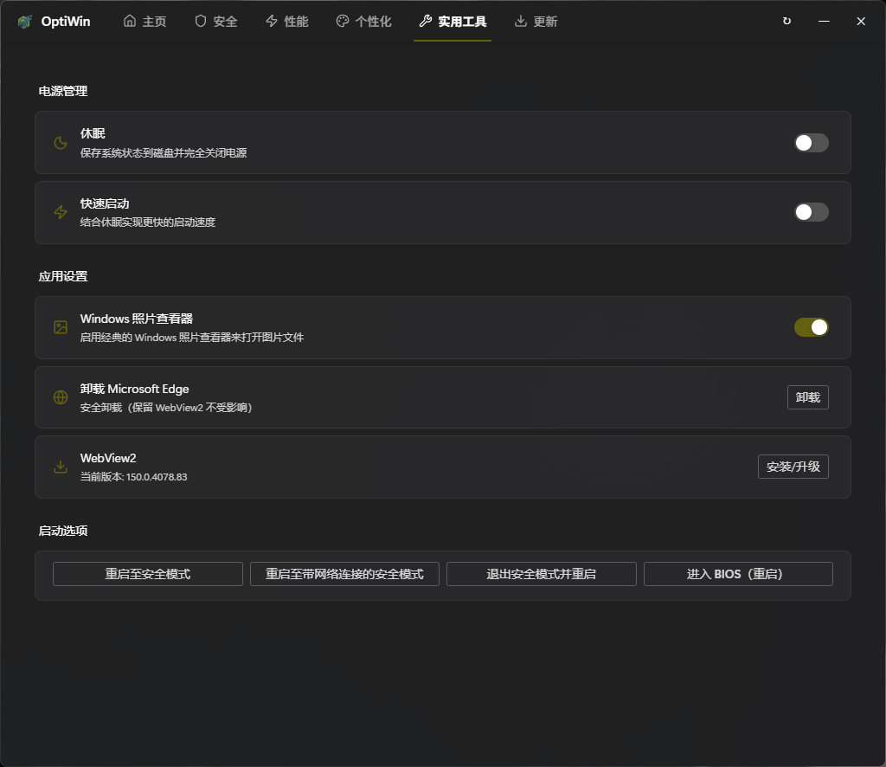
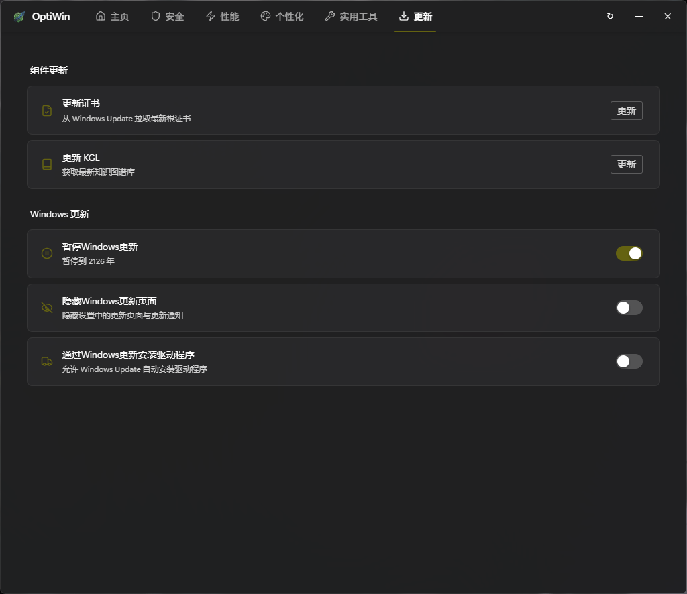

# OptiWin

<p align="center">
  
</p>

<p align="center" style="font-size:14px;color:rgba(255,255,255,0.4)">
  🌐 <a href="README_EN.md">English</a> | 中文
</p>

<p align="center">
  适用于 Windows 系统的个性化调整工具箱
</p>

## 截图








## 功能

- **首页** — 项目信息 + 系统信息（OS / CPU / 内存 / IP）
- **安全** — 安全中心引擎禁用 / 服务禁用 / 恢复 / UAC / VBS / 内存完整性
- **性能** — 电源计划 / C-State / Superfetch / 内存压缩 / 全屏优化 / 窗口优化 / MPO / 着色器缓存 / Xbox 服务（Game Bar）
- **个性化** — 通知 / 气球通知 / 边缘滑动 / 上下文菜单 / Explorer 主页和图库 / 快捷方式外观 / Win11 新版任务管理器开关
- **实用工具** — 休眠 / 快速启动 / 照片查看器 / Edge 卸载 / WebView2 / 安全模式 / 进入 BIOS
- **更新** — 证书更新 / KGL 更新 / 暂停更新 / 隐藏更新页面 / 驱动更新策略 / 更新通道切换

## 基于 [meetrevision/revision-tool](https://github.com/meetrevision/revision-tool) 二次开发

## 鸣谢

- **[PowerRun](https://www.sordum.org/81912/run-as-trustedinstaller-program-v1-6/)** — 用于以 TrustedInstaller 权限执行注册表操作
- **[ionuttbara/windows-defender-remover](https://github.com/ionuttbara/windows-defender-remover)** — Defender 禁用方案参考
- **[Lucide](https://lucide.dev/)** — 开源图标库

## 许可证

本项目基于 **GNU General Public License v3.0** 开源。

## 构建

```bash
# 编译 Windows
GOOS=windows GOARCH=amd64 CGO_ENABLED=1 CC=x86_64-w64-mingw32-gcc CXX=x86_64-w64-mingw32-g++ wails build -ldflags="-s -w" -trimpath
```

## 技术栈

| 层 | 技术 |
|----|------|
| 后端 | Go + Wails |
| 前端 | Vue 3 + Naive UI + Lucide |
| 注册表 | golang.org/x/sys/windows/registry |

## 提交

```bash
git add . && git commit -m "v1.1 - ..." && git push
```
