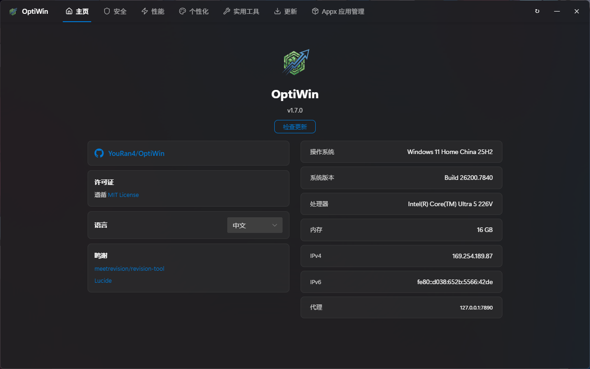
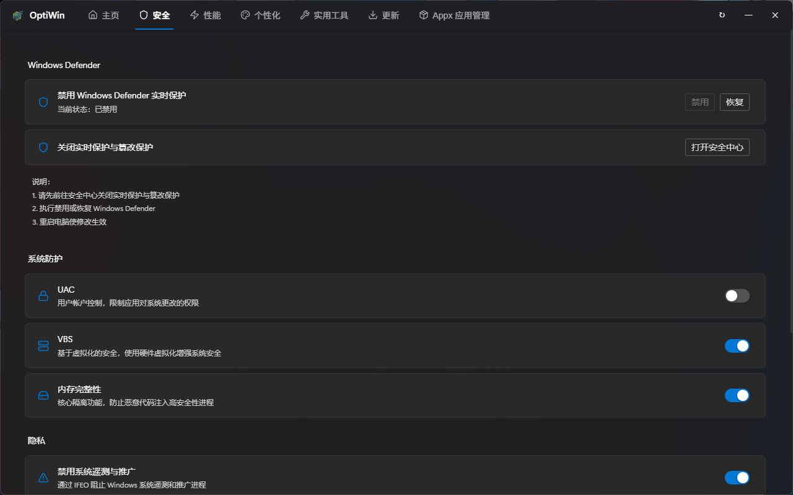
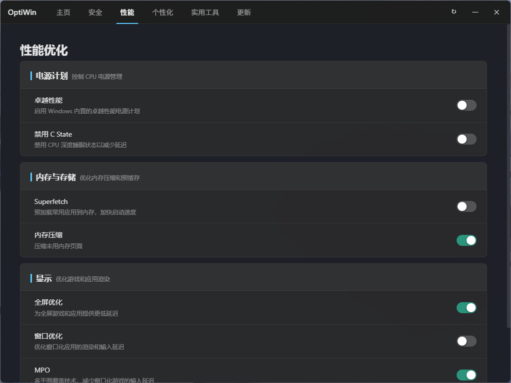
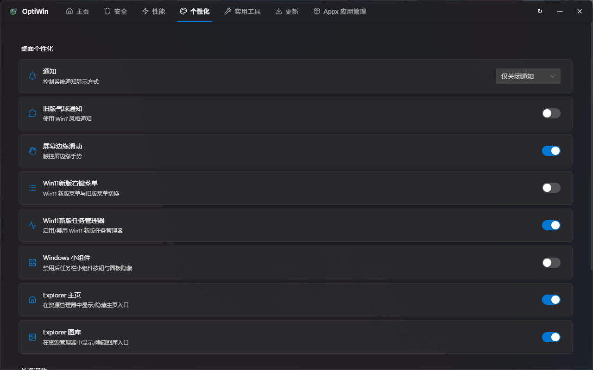
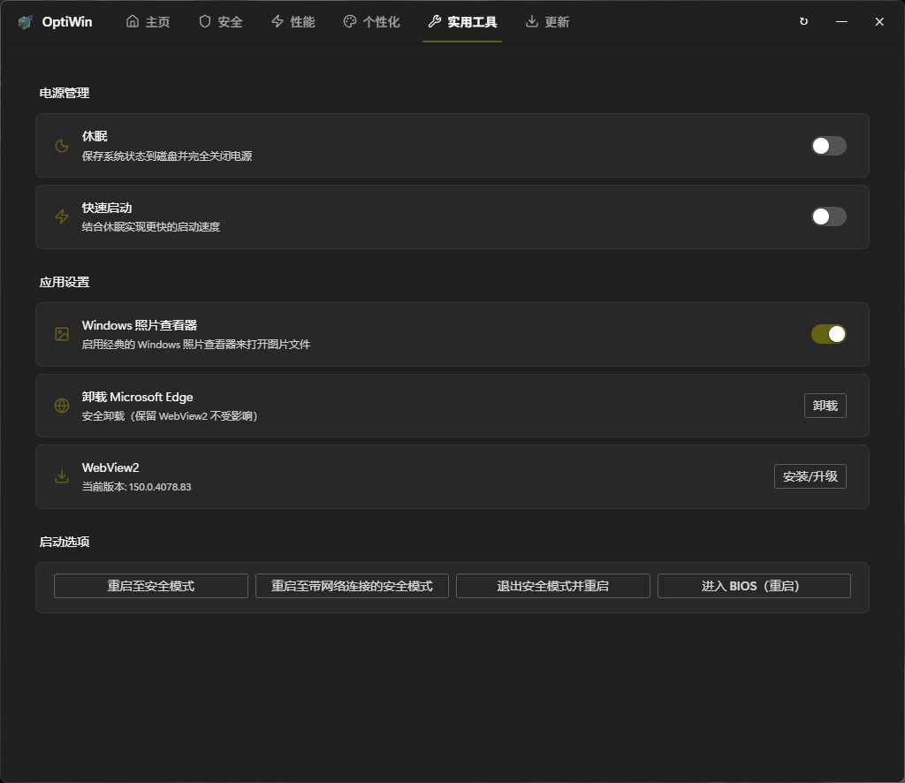
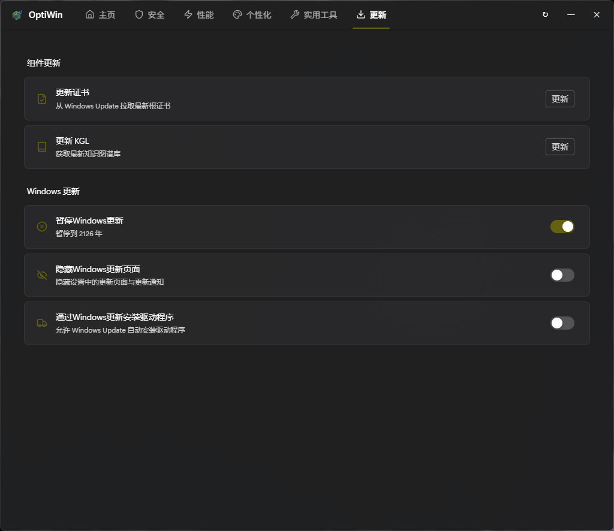

# OptiWin

<p align="center">
  
</p>

<p align="center" style="font-size:14px;color:rgba(255,255,255,0.4)">
  🌐 <a href="README_EN.md">English</a> | 中文
</p>

<p align="center">
  适用于 Windows 系统的个性化调整工具箱
</p>

## 设计理念

> **安全、可逆、克制**——这是 OptiWin 一切功能的出发点。

- **所有修改都可后悔**：每一项操作都提供对应的恢复功能，不做破坏性修改，不删除系统组件，绝不留下无法回头的状态。
- **不做激进操作**：不采用强制终止、删除系统文件、劫持关键驱动等高风险手段。系统稳定性与数据安全永远优先于"极致优化"。
- **Windows Defender 不提供完全禁用**：Defender 的实时保护与核心服务受到 Windows 自身的篡改防护（Tamper Protection）与内核驱动保护，强行禁用需要破坏性手段，与项目理念相悖。
- **明确不建议破坏安全链路**：例如 ELAM 启动驱动（WdBoot），在部分配备生物识别（指纹/人脸）的笔记本上，禁用会导致 Windows Hello 失效。OptiWin 保留此类信任链组件不动。

> 一句话总结：**你可以放心地调整每一项设置，因为每一项都能回到原点。**

## 截图








## 功能

- **首页** — 项目信息 + 系统信息（OS / CPU / 内存 / IP）
- **安全** — Defender 实时保护管理 / UAC / VBS / 内存完整性 / IFEO 镜像劫持管理 / DNS 切换 / 系统遥测阻止
- **性能** — 电源计划 / C-State / Superfetch / 内存压缩 / 全屏优化 / 窗口优化 / MPO / 着色器缓存 / Xbox 服务（Game Bar）
- **个性化** — 通知 / 气球通知 / 边缘滑动 / 上下文菜单 / Explorer 主页和图库 / 快捷方式外观 / Win11 新版任务管理器开关 / Windows 小组件开关
- **实用工具** — 休眠 / 快速启动 / 照片查看器 / Edge 卸载与安装 / WebView2 / 安全模式 / 进入 BIOS
- **更新** — 证书更新 / KGL 更新 / 暂停更新 / 隐藏更新页面 / 驱动更新策略 / 更新通道切换 / 多源回退检测

## 鸣谢

- **[meetrevision/revision-tool](https://github.com/meetrevision/revision-tool)** — 本项目灵感来源
- **[Lucide](https://lucide.dev/)** — 开源图标库

## 许可证

本项目基于 **MIT License** 开源。

## 构建

```bash
# 编译 Windows
GOOS=windows GOARCH=amd64 CGO_ENABLED=1 CC=x86_64-w64-mingw32-gcc CXX=x86_64-w64-mingw32-g++ wails build -ldflags="-s -w" -trimpath
```

## 技术栈

| 层 | 技术 |
|----|------|
| 后端 | Go + Wails |
| 前端 | Vue 3 + Naive UI + Lucide |
| 注册表 | golang.org/x/sys/windows/registry |

## 提交

```bash
git add . && git commit -m "v1.x - ..." && git push
```
