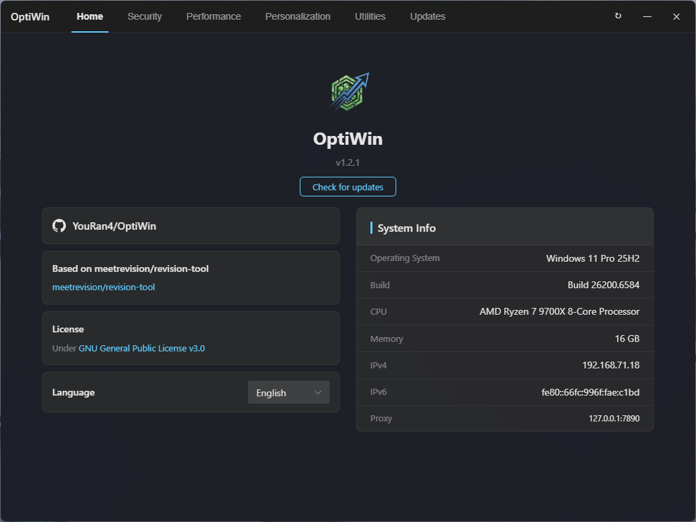
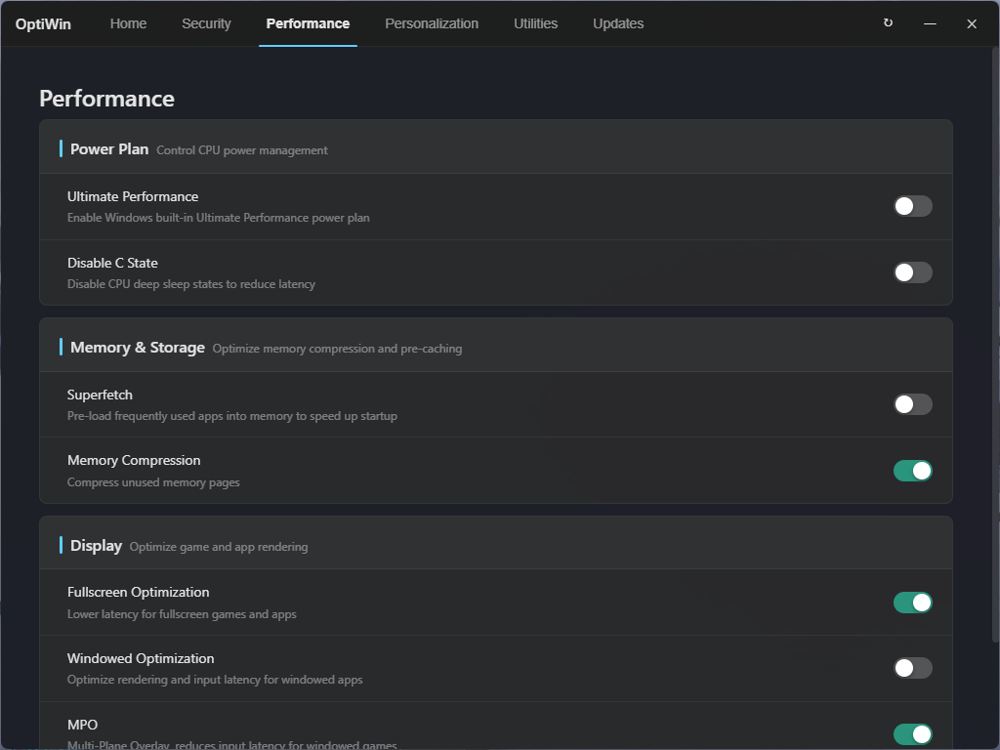
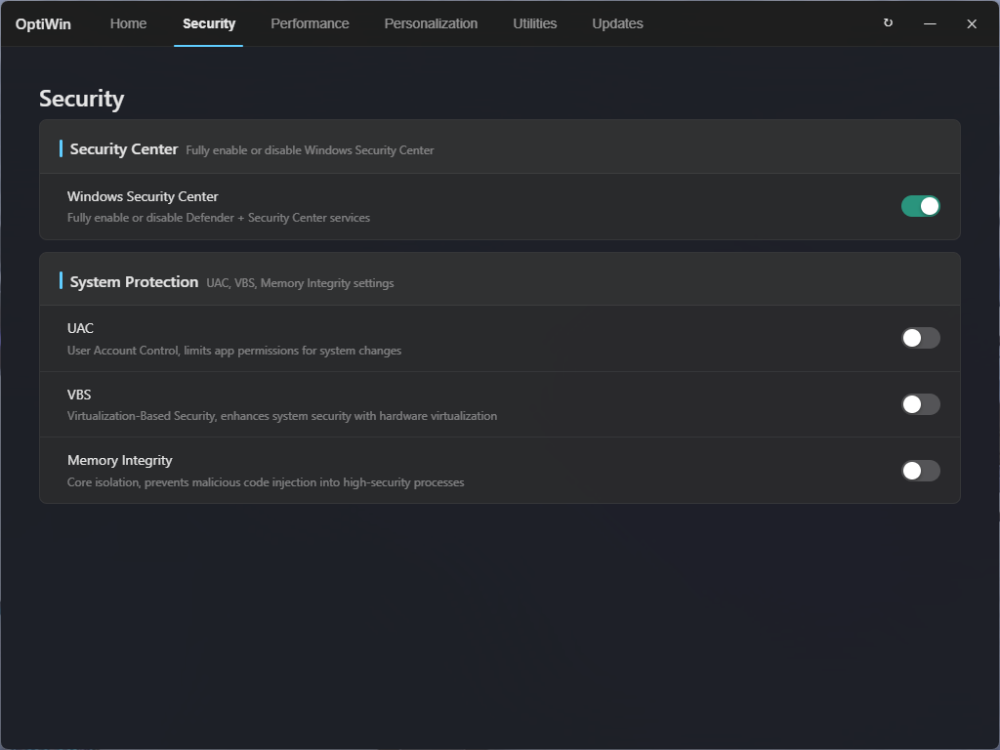

# OptiWin

<p align="center">
  
</p>

<p align="center" style="font-size:14px;color:rgba(255,255,255,0.4)">
  🌐 <a href="README.md">中文</a> | English
</p>

<p align="center">
  A Windows system optimization toolkit
</p>

## Screenshot





## Features

- **Home** — Project info + System Info (OS / CPU / Memory / IP)
- **Security** — Windows Defender / UAC / VBS / Memory Integrity
- **Performance** — Power Plan / C-State / Superfetch / Memory Compression / Fullscreen Optimization / Windowed Optimization / MPO / Shader Cache
- **Personalization** — Notifications / Balloon Notifications / Edge Swipe / Context Menu / Explorer Home & Gallery / Shortcut Appearance
- **Utilities** — Hibernate / Fast Startup / Photo Viewer / Uninstall Edge / WebView2 / Safe Mode / Enter BIOS
- **Updates** — Certificate Update / KGL Update / Pause Updates / Hide Update Page / Driver Update Policy / Update Channel

## Based on [meetrevision/revision-tool](https://github.com/meetrevision/revision-tool)

## License

This project is open source under the **GNU General Public License v3.0**.

## Build

```bash
# Build for Windows
GOOS=windows GOARCH=amd64 CGO_ENABLED=1 CC=x86_64-w64-mingw32-gcc CXX=x86_64-w64-mingw32-g++ wails build -ldflags="-s -w" -trimpath
```

## Tech Stack

| Layer | Technology |
|-------|-----------|
| Backend | Go + Wails |
| Frontend | Vue 3 + Naive UI |
| Registry | golang.org/x/sys/windows/registry |
