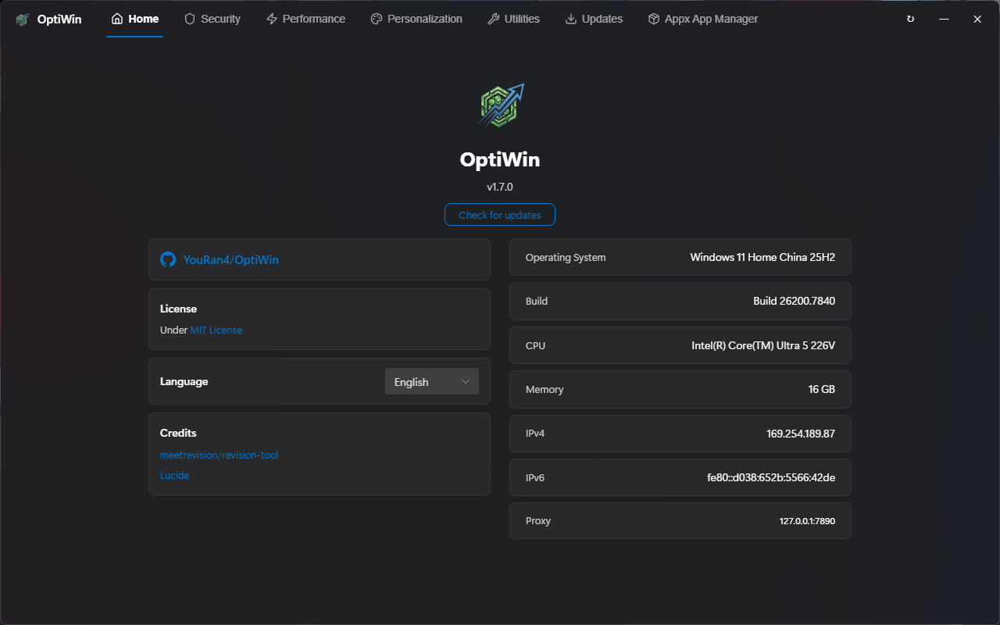
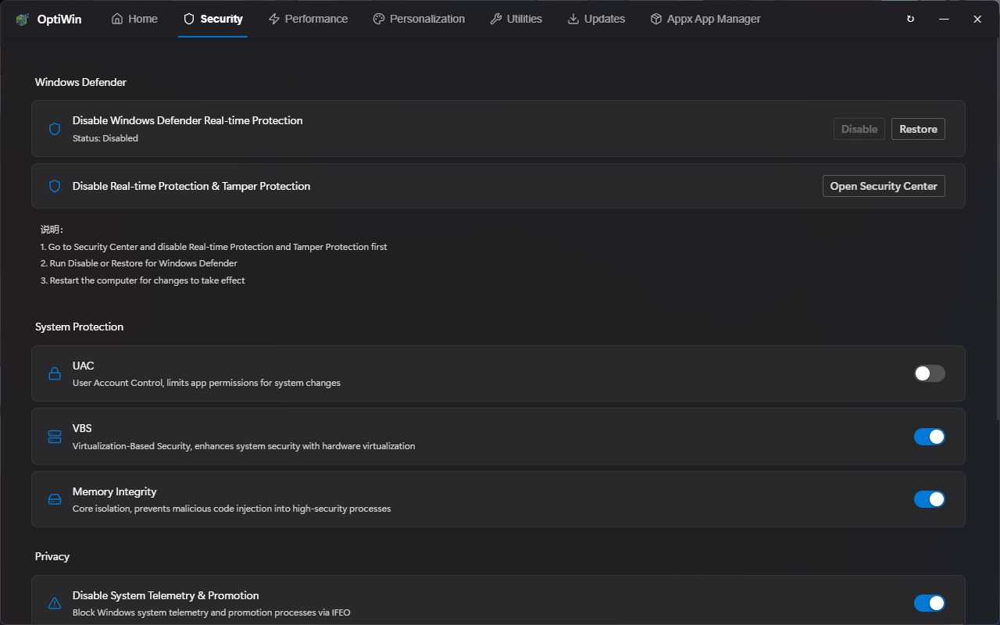
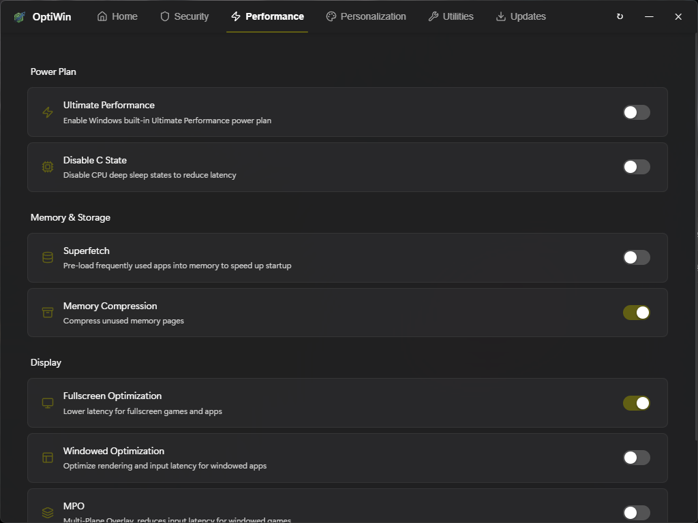
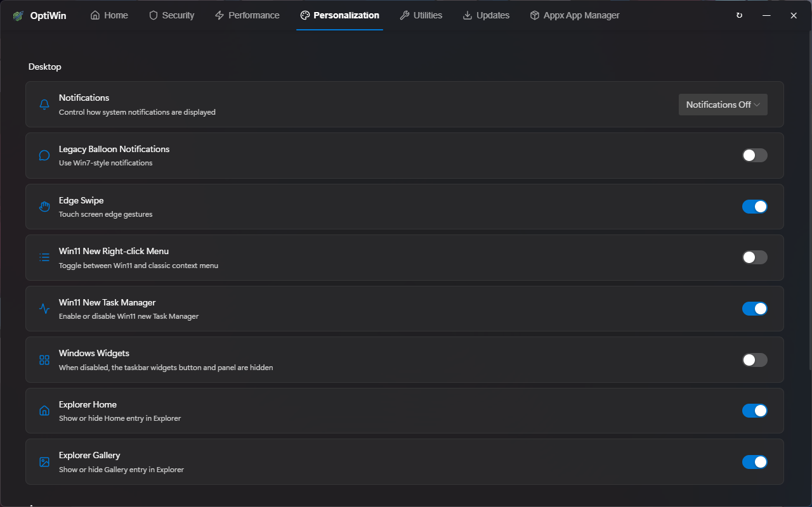
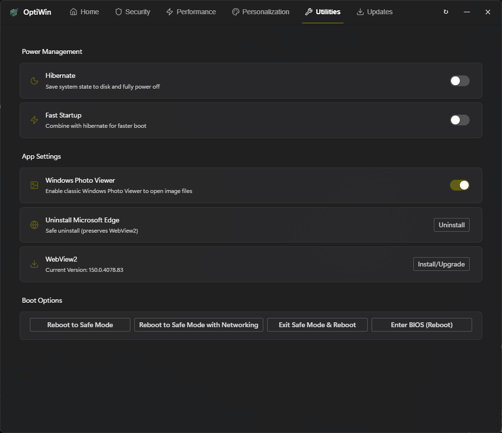
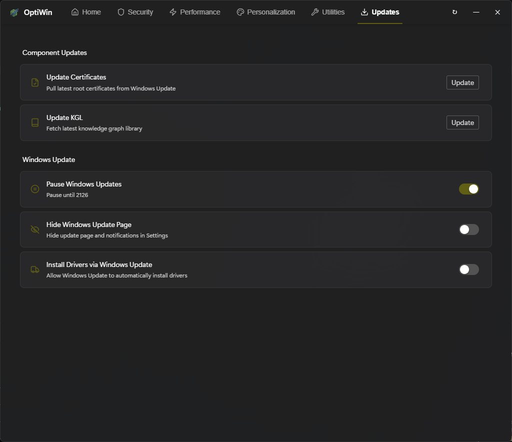

# OptiWin

<p align="center">
  
</p>

<p align="center" style="font-size:14px;color:rgba(255,255,255,0.4)">
  🌐 <a href="README.md">中文</a> | English
</p>

<p align="center">
  A Windows system optimization toolkit
</p>

## Design Philosophy

> **Safe, Reversible, Restrained** — this is the starting point for every feature in OptiWin.

- **Every change can be undone**: each operation ships with a corresponding restore function. No destructive modifications, no system component removal, never leave an irreversible state.
- **No aggressive operations**: high-risk techniques such as forced termination, deleting system files, or hijacking critical drivers are avoided. System stability and data safety always come before "extreme optimization".
- **No full disable of Windows Defender**: Defender's real-time protection and core services are protected by Windows' own Tamper Protection and kernel driver protection. Forcefully disabling them requires destructive means, which contradicts the project philosophy.
- **Explicitly avoid breaking the security chain**: for example, the ELAM boot driver (WdBoot) — on laptops with biometric authentication (fingerprint/face), disabling it causes Windows Hello to fail. OptiWin keeps such trust-chain components untouched.

> In one sentence: **You can confidently adjust every setting, because every setting can be reverted to its original state.**

## Screenshot








## Features

- **Home** — Project info + System Info (OS / CPU / Memory / IP)
- **Security** — Defender Real-time Protection Management / UAC / VBS / Memory Integrity / IFEO Management / DNS Switching / Telemetry Blocking
- **Performance** — Power Plan / C-State / Superfetch / Memory Compression / Fullscreen Optimization / Windowed Optimization / MPO / Shader Cache / Xbox Services (Game Bar)
- **Personalization** — Notifications / Balloon Notifications / Edge Swipe / Context Menu / Explorer Home & Gallery / Shortcut Appearance / Win11 New Task Manager Toggle / Windows Widgets Toggle
- **Utilities** — Hibernate / Fast Startup / Photo Viewer / Uninstall & Install Edge / WebView2 / Safe Mode / Enter BIOS
- **Updates** — Certificate Update / KGL Update / Pause Updates / Hide Update Page / Driver Update Policy / Update Channel / Multi-source Fallback Check

## Credits

- **[meetrevision/revision-tool](https://github.com/meetrevision/revision-tool)** — Inspiration for this project
- **[Lucide](https://lucide.dev/)** — Open source icon library

## License

This project is open source under the **MIT License**.

## Build

```bash
# Build for Windows
GOOS=windows GOARCH=amd64 CGO_ENABLED=1 CC=x86_64-w64-mingw32-gcc CXX=x86_64-w64-mingw32-g++ wails build -ldflags="-s -w" -trimpath
```

## Tech Stack

| Layer | Technology |
|-------|-----------|
| Backend | Go + Wails |
| Frontend | Vue 3 + Naive UI + Lucide |
| Registry | golang.org/x/sys/windows/registry |
